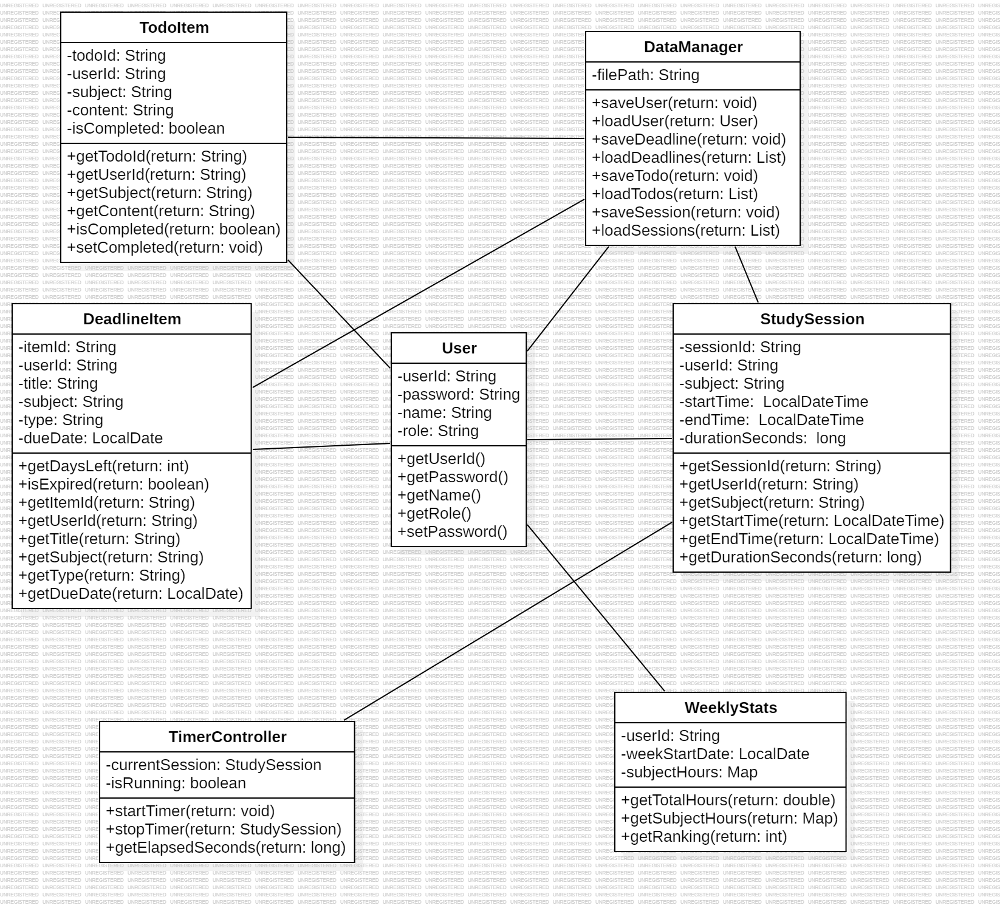

# StudyTogether

> 3. Design

---

| | |
|---|---|
| **Student No** | 22411843 |
| **Name** | 정혜원 |
| **E-Mail** | jhw4381@naver.com |

---

## [ Revision History ]

| Revision date | Version # | Description | Author |
|---|---|---|---|
| 2026/06/03 | 1.00 | First draft | 정혜원 |

---

## = Contents =

1. Introduction
2. Class diagram
3. Sequence diagram
4. State machine diagram
5. Implementation requirements
6. Glossary
7. References

---

## 1. Introduction

본 문서는 Analysis 단계의 문서에 이어지는 Design 단계의 문서이다.

Analysis 단계에서는 시스템이 **무엇을 하는가**에 초점을 맞춰 Use Case와 Domain 분석을 수행하였다. 본 Design 문서에서는 이를 바탕으로 시스템을 **어떻게 구현할 것인가**를 구체화한다. Class Diagram을 통해 클래스 간의 정적 구조를 정의하고, Sequence Diagram을 통해 각 Use Case의 동적 흐름을 표현하며, State Machine Diagram을 통해 시스템의 상태 전이를 기술한다.

StudyTogether는 Java Swing 기반의 데스크탑 프로그램으로, 사용자 데이터는 JSON 형식의 로컬 파일로 관리된다.

### Important Points of Design

- 사용자 권한(일반 User / Administrator)에 따라 접근 가능한 기능을 구분한다.
- 모든 데이터는 `DataManager` 클래스를 통해서만 로컬 파일에 읽고 쓴다.
- 타이머 로직과 UI는 분리하여 `TimerController`가 시간 계산을 담당한다.
- 주간 통계 및 순위 집계는 `WeeklyStats` 클래스에서 처리한다.

---

## 2. Class diagram

아래의 그림은 StudyTogether 시스템의 Class Diagram을 나타낸 것이다.



### Class 설명

| Class | 설명 |
|---|---|
| User | 사용자 계정 정보를 저장하는 클래스. userId, password, name, role 속성을 가진다. |
| DeadlineItem | D-day 항목을 나타내는 클래스. 과제/시험의 제목, 과목, 마감일을 저장하고 남은 일수를 계산한다. |
| StudySession | 타이머 한 회 기록을 저장하는 클래스. 과목, 시작/종료 시각, 경과 시간을 포함한다. |
| TodoItem | 과목별 할 일 항목을 나타내는 클래스. 완료 여부를 체크할 수 있다. |
| DataManager | 모든 데이터의 로컬 파일 입출력을 전담하는 클래스. |
| TimerController | 공부 타이머의 시작·중지·경과 시간 계산을 담당하는 클래스. |
| WeeklyStats | 주간 공부 통계 및 순위를 계산하는 클래스. |

---

## 3. Sequence diagram

아래의 그림은 StudyTogether 시스템의 주요 Use Case별 Sequence Diagram을 나타낸 것이다.

### 3-1. Register (회원가입)

```
User        UI          DataManager
 |           |               |
 |--입력---->|               |
 |           |--saveUser()-->|
 |           |<--완료--------|
 |<--완료----|               |
```

### 3-2. Login (로그인)

```
User        UI          DataManager
 |           |               |
 |--입력---->|               |
 |           |--loadUser()-->|
 |           |<--User--------|
 |<--성공----|               |
```

### 3-3. Register Deadline (D-day 등록)

```
User        UI          DataManager
 |           |               |
 |--입력---->|               |
 |           |--saveDeadline()->|
 |           |<--완료--------|
 |<--완료----|               |
```

### 3-4. Start/Stop Study Timer (타이머)

```
User        UI       TimerController   DataManager
 |           |              |               |
 |--시작---->|              |               |
 |           |--startTimer()->|             |
 |--종료---->|              |               |
 |           |--stopTimer()->|              |
 |           |<--StudySession|              |
 |           |--saveSession()-------------->|
 |<--완료----|              |               |
```

### 3-5. Manage Todo (할 일 관리)

```
User        UI          DataManager
 |           |               |
 |--추가---->|               |
 |           |--saveTodo()-->|
 |           |<--완료--------|
 |<--완료----|               |
```

### 3-6. View Statistics (통계 조회)

```
User        UI       WeeklyStats     DataManager
 |           |              |               |
 |--조회---->|              |               |
 |           |--loadSessions()------------->|
 |           |<--sessions----|              |
 |           |--getTotalHours()->|          |
 |           |<--통계--------|              |
 |<--표시----|              |               |
```

---

## 4. State machine diagram

아래의 그림은 StudyTogether 시스템의 State Machine Diagram을 나타낸 것이다.

```
[시작]
  |
  v
[로그인 화면] --로그인 성공--> [홈 화면]
                                  |
              +---------+---------+---------+---------+
              |         |         |         |         |
              v         v         v         v         v
          [D-day    [타이머    [Todo     [통계      [관리자
           화면]     화면]      화면]     화면]      화면]
              |         |         |         |         |
              +---------+---------+---------+---------+
                                  |
                              [로그아웃]
                                  |
                                  v
                            [로그인 화면]
```

---

## 5. Implementation requirements

### Software Requirements

| 항목 | 내용 |
|---|---|
| 개발 언어 | Java |
| UI 프레임워크 | Java Swing |
| 데이터 저장 | JSON 로컬 파일 |
| 개발 도구 | IntelliJ IDEA 또는 Eclipse |
| JDK 버전 | JDK 11 이상 |

### Hardware Requirements

| 항목 | 내용 |
|---|---|
| OS | Windows 10 이상 / macOS 10.14 이상 |
| RAM | 최소 4GB |
| 저장공간 | 최소 100MB |

---

## 6. Glossary

| Terms | Description |
|---|---|
| D-day | 과제 제출 또는 시험 날짜까지 남은 일수. 사용자가 직접 등록한다. |
| 공부 타이머 | 사용자가 과목을 선택한 후 공부 시작·종료 시각을 기록하는 기능. |
| To-do | 과목별로 사용자가 직접 입력하는 할 일 항목. 완료 여부를 체크할 수 있다. |
| 주간 통계 | 한 주(월~일) 동안의 과목별 공부 시간을 집계한 데이터. |
| StudySession | 타이머를 시작하고 중지한 한 번의 공부 기록 단위. |
| TimerController | 공부 타이머의 시작·중지·경과 시간 계산을 담당하는 클래스. |
| DataManager | 모든 데이터의 로컬 파일 입출력을 전담하는 클래스. |
| role | User 클래스의 속성으로, "user" 또는 "admin" 값을 가진다. |

---

## 7. References

1) 대학생 학습 관리 실태 관련 조사 : https://www.20slab.org/
